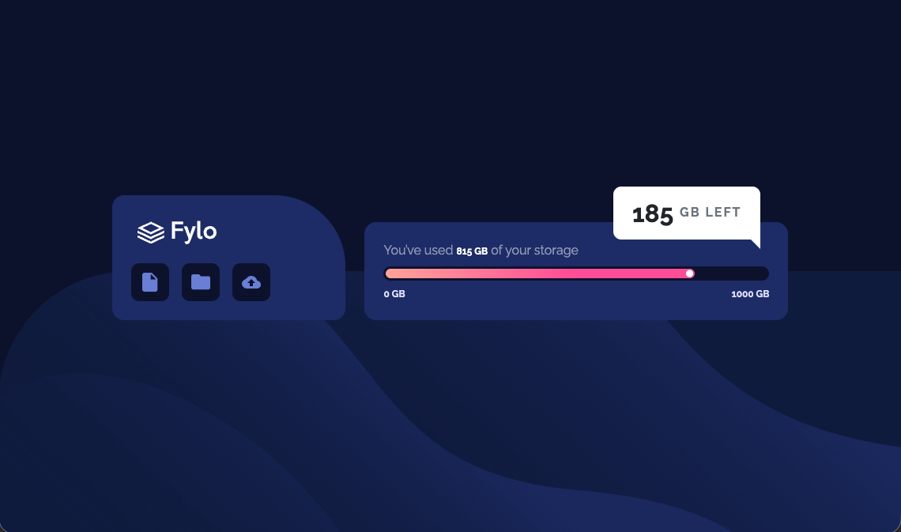

# Frontend Mentor - QR code component solution

This is a solution to the [Fylo data storage component challenge ** using bootstrap ** on [Frontend Mentor](https://www.frontendmentor.io/challenges/fylo-data-storage-component-1dZPRbV5n). Frontend Mentor challenges help you improve your coding skills by building realistic projects.

## Table of contents

- [Overview](#overview)
  - [Screenshot](#screenshot)
- [My process](#my-process)
  - [Built with](#built-with)
  - [What I learned](#what-i-learned)
  - [AI Collaboration](#ai-collaboration)
- [Author](#author)
- [Acknowledgments](#acknowledgments)

## Overview
this is my completed version of the Fylo data storage component challenge ** using bootstrap ** from Frontend Mentor.

### Screenshot

## My process
Began by formatting index.html head to make connections with googleapi fonts, and bootstrap's cdn. Took a linear approach to tagging the index.html and css stylesheet with familiar css styles, creating classes, and adding some bootstrap utilities.

Once this initial structure was completed I made modifications to the body and container(s) formatting, consistently checking the visual layout after each code change.  

### Built with

- Semantic HTML5 markup
- Custom CSS
- bootstrap's css libraries

### What I learned

1. Bootstrap limitations impacts css styles by precidence and the bootstrap index on getbootstrap.com's website often populates unexpeceted results compared to the framework library references.
    - example: setting .bg-primary-subtle did not provide the expected background color.
    - resolution: bootstrap code had to be refined and removed in some cases, and vice versa if bootstrap contained code I found acceptable for the challence.
2. Standard CSS can be layered on top of bootstrap utilities. 
3. CSS pseudo-element
    - .storage-badge::after

## AI Collaboration
  - ChatGBT
  - Native AI in Browser contemporary browsers

## Author

Zac White
- Frontend Mentor - unpublished/non-submittal

## Acknowledgments
  - [getbootstrap](https://getbootstrap.com)
  - [FREEFORMATTER](https://www.freeformatter.com/html-validator.html)
  - ChatGBT (for debugging, and pixel to rem conversions)
  - K. Stevenson for collaboration and conversation. 

## Reflections
1. I faced frustration searching and choosing the correct code to apply and would use my preferred browser or chrome search (both of which have implemented AI components - unavoidable use of AI) and chatGBT to find answers to those puzzles.  
2. Bootstrap's precedence (incl. learning it simulatenaeously with CSS styles and formatting) and the libraries inaccuracies was frustrating.
3. Finding conflicting code techniques manually is difficult, online resources for verifying code are very useful.
4. Bootstrap has limitations and some components, and utilities interfere with custom CSS style.  